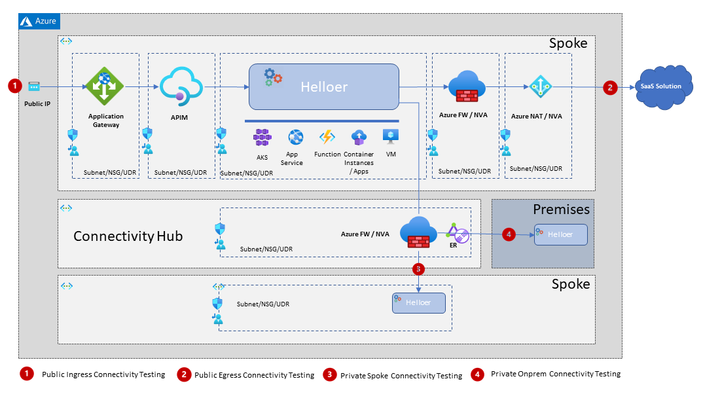

# Helloer, a tiny workload to test your cloud connectivity

## Motivation 

When working on the cloud deployement, and more specifically when dealing with moves to Cloud you often end with a hybrid architecture that usually has it's own (customer driven) complexity.

During those projects you will be required to validate all of your LZ design, mostly on the network connectity & security levels.

In order to test your connectivity and eventually deliver a POC/Study you'll need a tiny workload to deploy on different places of the cloud and hybrid infrastructure.

This is exactly the purpose of this workload, that can be deployed on most of the hosting infrastructures (VM, Functions, Kubernetes, Application services) and can be used to test direct or transitive connectivity to your Cloud and hybrid architecture. 

## Features

The following diagram illustrates a usage of the Helloer for poc-ing the network and security aspects of an Azure ESLZ design, however it can be accomadated for pretty much any Cloud : 



### Public Ingress Connectivity

In this use case you'd like to deploy the workload on it's hosting infrastructure and to call it from a certain place of your cloud architecture, or even test public ingress connectivity to your workload.

In order to do that you can simply hit the **'/connectivity/local'** endpoint of the workload and get yourself a short response JSON payload.

### Public Egress Connectivity

In this use case you'd like to deploy the workload on it's hosting infrastructure and to make sure it has connectivity to external, publicly hosted SaaS solutions.

In order to do that you can simply hit the **'/connectivity/public'** endpoint of the workload which will in turn call the Github API to list the repos of a given user. It is a conveniant way for testing the egress public connectivity and can be also used to highlight all the security (NAT, FW) that will be applied on such workloads.

### Private Spoke Connectivity

In this use case you'd like to deploy the workload on it's hosting infrastructure and to make sure it has connectivity to other LZs in your cloud scope. In Azure it would bind to the notion of "spoke" , and you would usually need to traverse the Hub part ( mainly the Connectivity subscription of the Azure ESLZ).

In order to do that you can simply hit the **'/connectivity/spoke'** endpoint of the workload which will in turn call another Helloer or any other http level server placed in another spoke. You can override the transitive url via an evnronnement property.

### Private On Prem Connectivity 

In this use case you'd like to deploy the workload on it's hosting infrastructure and to make sure it has connectivity to your on premises workloads. In this case you're going to be testing the transversal of private hybrid connectivity trunks ( such as Azure Express route) and also the security enforcements on this path ( usually traversing the Azure HUB Connetivity ESLZ subscription).

In order to do that you can simply hit the **'/connectivity/onprem'** endpoint of the workload which will in turn call another Helloer or any other http level server placed in another spoke. You can override the transitive url via an evnronnement property. You can also extend and override the current handler to write something more complex then a simple HTTP hit.

### Health Probes

In this use case you'd like to deploy the workload on an infrastructure that lives behind a Load Balancer. It can be Kubernetes, VM Sets or any other scale-out technology. 

Most of the available infrastructures will require healthchecks, being it on the Kub level or simply as a backend probe for most of the LBs ( think backend health on Azure App Gateways).

In order to integrate with those infrastructures you can use the  **'/health'** endpoint of the workload that will return a small payload with a 200 HTTP status, which is more then sufficient to deploy the workload in those conditions

## Code 

The code is pretty staightfoward and easy to update : 

* **app.js** is the main application entry point 
* http handlers are stored under the **handlers** directory
* utility modules (logger, response builder) are stored under the **util** directory

A simple Docker file, located in the root folder, is used for packaging the Helloer as a container so you can to host it on any kind of cloud infra.

## Usage 

### Configuration 

The overall configuration is performed via environnement variables in order to fit with the container deployement model.

The following table lists the used environnement variables : 

| Env Var Name                        | Default Value      | Purpose                                                      |
|-------------------------------------|--------------------|--------------------------------------------------------------|
| HELLOER_PORT                        | 8080               | The http port to serve                                       |
| HELLOER_BACKEND_TYPE                | helloer            | The type of the backend, will determine the log filename and appear in the reponse payload  | 
| HELLOER_BACKEND_ID                  | generated UUID     | The id of the backend, will appear in the reponse payload    | 
| HELLOER_FORWARDER_GITHUB_USERNAME   | funkomatic         | Used as github user to list it's public repos, SaaS test    |
| HELLOER_FORWARD_PRIVATE_URL         | http://localhost:8080/connectity/private         | URL to hit to test spoke to spoke connectivity, change the value to fit the deployed helloer in another spoke |
|HELLOER_FORWARD_ONPREM_URL   | http://my.host.is:9086/whatever  | Used for onprem test, obvioulsy you'll have to override that one with a valid url exposed on prem    |

### HTTP Endpoints 

| Endpoint                | Usage                     |
|-------------------------|---------------------------|
| /health                 | health probe for containerized infra, returns HTTP code 200 if running |
| /connectivity/local     | helloer responder, siply says hello |
| /connectivity/public    | translates calls to github api |
| /connectivity/spoke     | translates calls to other spoke http server (you can use a dedicated helloer as well) |
| /connectivity/onprem    | translates calls to on prem http server (uou can use a dedicated helloer as well) |

### HTTP Responses

#### Common Reponse Payload

All response payloads will contain at least the identification of the backend, and some usefull infromation on the request, handy to track your flows when traversing NATs, LBs : 

```json
{
  "backend_type": "helloer",
  "backend_id": "helloer-6d8a3c0a-fcdd-465e-a980-48f5e3462833",
  "request_source_ip": "::ffff:127.0.0.1",
  "response_id": "8843d16f-775c-4332-a911-4ccf37a11252",
  "response_date": "2022-02-10T10:43:47.534Z"
}
```

The **'response_id'** and **'response_date'** fields will be re-generated for each request, helping to track the responses behind routing/redirection services.

#### Specific Reponse Payloads

When the workload will reach for an external system (spoke, saas solution, onprem), the payload will be extended with attributes named **<connectivity.type_status>** , providing the status of the bounced call and **<connectivity.type_response>** providing the payload response from the external system.

For instance, when addressing another spoke helloer, the payload will look similar to the following : 

```json
{
  "backend_type": "helloer",
  "backend_id": "helloer-6d8a3c0a-fcdd-465e-a980-48f5e3462833",
  "request_source_ip": "::ffff:127.0.0.1",
  "response_id": "d85ea02c-5a84-4d00-897b-1ec5d3f1041d",
  "response_date": "2022-02-10T10:42:50.164Z",
  "spoke_status": "success",
  "spoke_response": {
    "backend_type": "spoker",
    "backend_id": "spoker-2ffcb186-5e9c-4431-9d4a-9157304fe2f1",
    "request_source_ip": "::ffff:127.0.0.1",
    "response_id": "17adc02c-6722-413e-bcda-9e56e7a80cb2",
    "response_date": "2022-02-10T10:42:50.168Z",
    "message": "hello"
  }
}
```


### Starting the app

Clone the repo, eventually override the environnement variables then perform the following commands : 

```bash
npm run app:clean
npm run app:init
npm run app:start
```

And expect an output silmilar to the following : 

```bash
> helloer@1.0.1 app:start
> node app.js

2022-02-24 09:38:29-99 [info] (helloer) starting backend
2022-02-24 09:38:30-00 [info] (helloer) backend started, listening on port=8080
```
Note the *(helloer)* tag that is defined by the *HELLOER_BACKEND_TYPE* environnement variable.

A **start.sh** script is also provided and is intended to run the app on a **Linux** VMs in detached mode using the following cmd line : 

```bash
nohup ./start.sh &
```

## Logs 

The application will produce a log file which naming depends on the value of the *HELLOER_BACKEND_TYPE* environnement variable, the log file pattern being *HELLOER_BACKEND_TYPE*.log.

example :

```bash
export HELLOER_BACKEND_TYPE=webapp1
npm run app:start
```

```bash
ls *.log
webapp1.log
```

## Packaging

### Generate binary package

You can build a binary package ready to run using the following commands : 

```bash
npm run app:clean
npm run app:init
npm run app:package
```

This sequence will create an archive named **helloer-dist-vMAJ.vMIN.vREL.tgz** to be used on any VM provided you already have a node/npm installation. 

For version 1.0.0 , you'll see the following file created : 
```bash
helloer-dist-1.0.0.tgz
```


### Use docker image

For containerized deployements you can use the image available on the [Docker Hub](https://hub.docker.com/repository/docker/zlatkoa/helloer). It is updated by the Github CI/CD worklow on each code change.

You can also build your own image using the provided Dockerfile by issuing, for instance : 

```bash
npm run app:dockerize
```


